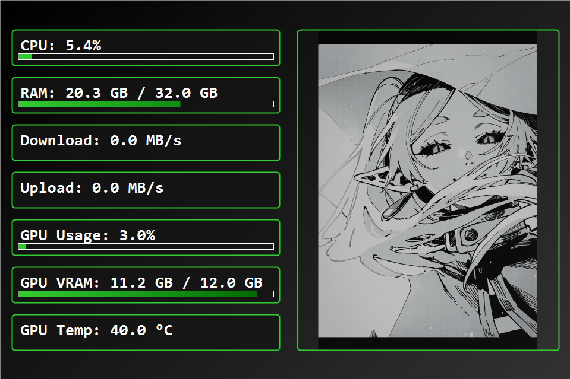

# System Stats Monitor

A modern, lightweight system monitoring application for Windows, designed to display real-time hardware statistics on a dedicated 960x640 monitor. The application features a sleek UI with progress bars, a slideshow of images, and system tray integration.

## Features

- **Real-Time Stats**: Monitors CPU usage, RAM usage, network download/upload speeds, GPU usage, VRAM, and temperature.
- **Custom UI**: Displays stats in a visually appealing interface with gradient backgrounds, progress bars, and fade animations.
- **Slideshow**: Cycles through images in an `/images` directory with smooth fade transitions.
- **System Tray Integration**: Runs in the system tray with a context menu to show/hide the app or exit.
- **Targeted Display**: Automatically detects a 960x640 monitor or falls back to the primary screen.

## Screenshots



## Prerequisites

- **Windows OS**: Windows 10 or later.
- **.NET Framework**: .NET Core 3.1 or later (adjust based on your `csproj` target).
- **Administrative Privileges**: Required for GPU monitoring via LibreHardwareMonitor.
- **Monitor**: A 960x640 resolution monitor is recommended for optimal display.


## Installation

1. **Clone the Repository**:
   ```bash
   git clone git@github.com:thanatath/aidaAlternative.git
   cd aidaAlternative
   ```
2. **Build**:
   ```bash
   dotnet build
   ```
3. **Run**:
   ```bash
   dotnet run
   ```

The application starts a web server at `http://localhost:8080` where you can upload images and manage the slideshow gallery.
